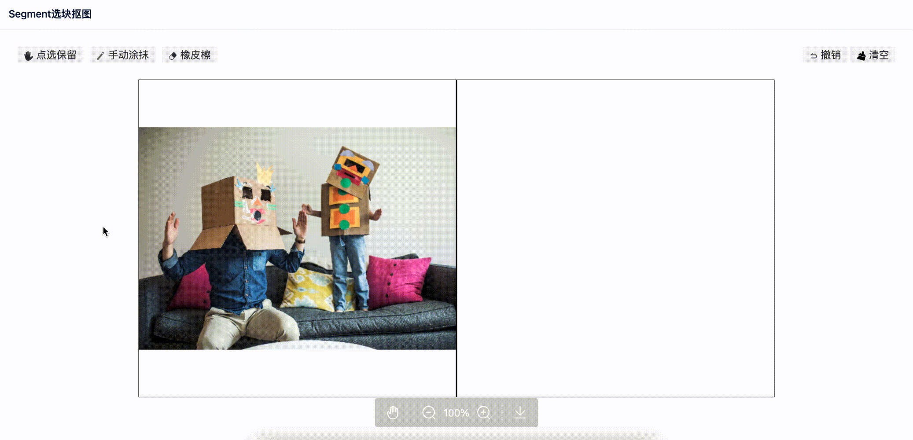

# BlockSegment
基于SegmentAnything的选块抠图功能，目前只把前端发布上来，服务端还没整理。


<table>
  <tr>
    <td align="center">
      功能演示<br>
      
    </td>
  </tr>
</table>


# 本地启动

- 安装[http-server](https://github.com/http-party/http-server)

- 进入到项目目录，启动http服务

```
http-server -p 8000
```

- 浏览器访问
```
http://localhost:8000/index.html
```

- 使用example目录下的demo.jpg测试，因为没有使用后端，目前固定了这个图片才能使用，seg_mock_data.json文件指定了该图片的sam数据


# 注意

该项目待完善，比如分辨率、边缘处理等细节需要处理，期待前端高手来共同优化。
